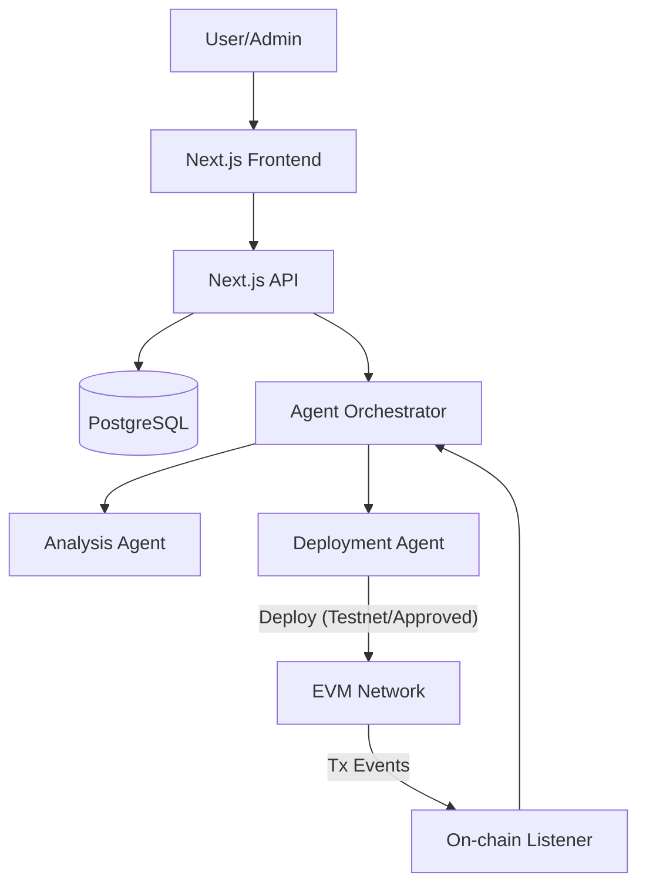
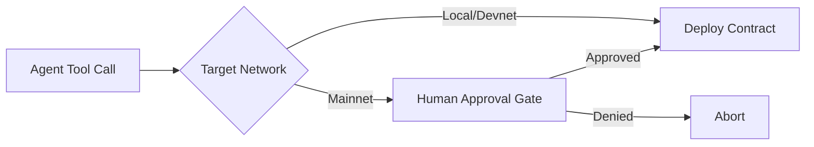
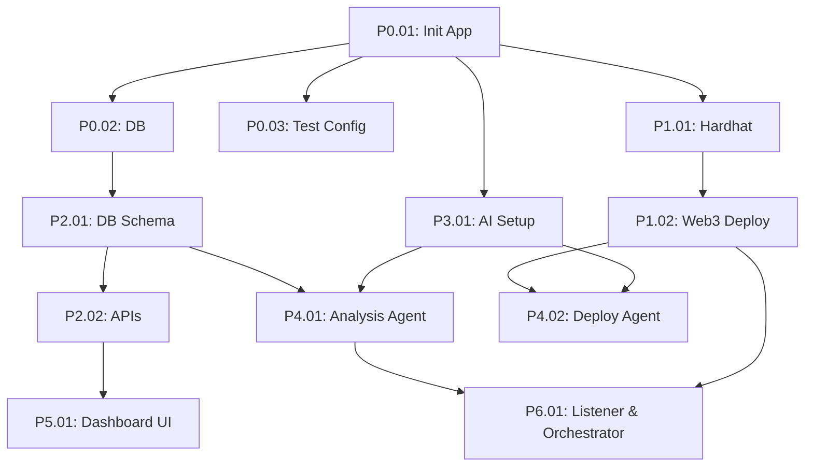

# Honychain — Implementation Plan

## 1. Executive Summary
Honychain is an AI-powered blockchain security platform designed to deploy deceptive smart contracts (honeypots) and autonomously analyze attacker behavior. Targeting blockchain security researchers and protocol developers, it provides real-time threat intelligence by interpreting on-chain interactions using LLM agents. The project is currently in the pre-implementation phase. The objective is to build a full-stack MVP enabling testnet honeypot deployment, event monitoring, and AI-driven attack narrative generation.

## 2. Project State
| Area            | Current State | Target State |
| --------------- | ------------- | ------------ |
| Codebase        | `PRE-IMPLEMENTATION` (Empty shell) | Next.js monorepo |
| Frontend        | None | React / Tailwind dashboard |
| Backend         | None | Next.js API Routes |
| Database        | None | PostgreSQL (Prisma) |
| Smart Contracts | None | Solidity templates (Hardhat) |
| AI              | None | LLM Provider integration |
| Agents          | None | Deployment & Analysis Agents |
| Testing         | None | Vitest + Hardhat local node |
| Deployment      | None | Vercel (Web) + Supabase (DB) |
| Documentation   | Templates present | Synced with reality |

## 3. Goals
- **P0**: Initialize full-stack monorepo, database, and EVM integration.
- **P0**: Programmatic deployment of honeypot smart contracts to local/testnets.
- **P0**: AI Analysis Agent capable of interpreting transaction data and generating threat reports.
- **P1**: Dashboard UI to view active honeypots and threat intelligence.
- **P1**: Event listener to trigger analysis on honeypot interactions automatically.
- **P2**: Deployment Agent for autonomous selection and deployment of varied honeypot templates.

## 4. Non-Goals
- **NOT IN MVP**: Mainnet deployment without human approval.
- **NOT IN MVP**: Advanced fund-recovery or counter-attack mechanisms.
- **FUTURE**: Support for non-EVM chains (Solana, Aptos).
- **FUTURE**: Custom fine-tuned LLMs for smart contract bytecode analysis.

## 5. Architecture Baseline

### Current Architecture
None (Pre-implementation).

### Target Architecture


### Key Components & Responsibilities
- **Frontend / API**: Next.js App Router for UI and REST/RPC endpoints.
- **Agent Orchestrator**: Routes triggers (UI or Listener) to the correct Agent.
- **Deployment Agent**: Selects, compiles, and deploys Solidity honeypots.
- **Analysis Agent**: Decodes calldata and uses LLM reasoning to summarize attack vectors.
- **On-chain Listener**: Polls or uses WebSockets to monitor honeypot addresses.

## 6. Technology Decisions

| Area | Decision | Reason | Alternative | Risk |
|---|---|---|---|---|
| Frontend | Next.js + Tailwind | Fast iteration, unified stack | Vite/React | Low (Standard) |
| Backend | Next.js API Routes | Simplifies deployment/monorepo | Express/Nest | Low |
| Database | PostgreSQL + Prisma | Type-safe, relational fit for Tx data | MongoDB | Low |
| Blockchain | ethers.js + Hardhat | Industry standard for deployment/testing | viem / Foundry | Low |
| AI | LangChain + Gemini/OpenAI | Native agent abstractions and tool calling | Direct API calls | Vendor lock-in |
| Agent Runtime | LangGraph (or Custom) | Stateful agent flows and human-in-loop | AutoGen | Complexity |
| Testing | Vitest | Fast, native ESM support | Jest | Low |
| Deployment | Vercel (Web) | Zero-config deployments | AWS/Docker | Low |

## 7. Security Model

### Autonomous
- Monitoring public blockchain addresses.
- Fetching transaction traces and logs.
- Generating threat analysis reports via LLM.
- Deploying honeypots to **Local EVM** or **Private Devnets**.

### Approval Required
- Deploying honeypots to **Mainnet** or public testnets with real economic value.
- Any action transferring funds out of the platform wallet.

### Forbidden
- Exposing private keys, mnemonic phrases, or RPC credentials to the LLM context.
- Agents writing or modifying source code outside of designated scratchpad areas.
- Agents executing arbitrary shell commands on the host machine.



## 8. Implementation Phases

- **PHASE 0 — FOUNDATION**: Initialize monorepo, database, and testing.
- **PHASE 1 — SMART CONTRACT / EVM LAYER**: Solidity templates and deployment scripts.
- **PHASE 2 — DATA + API**: Database schema and internal APIs.
- **PHASE 3 — AI LAYER**: Provider abstraction and agent reasoning.
- **PHASE 4 — AGENT SYSTEM**: Deployment and Analysis Agents with tools.
- **PHASE 5 — FRONTEND**: Dashboard and Threat UI.
- **PHASE 6 — END-TO-END INTEGRATION**: Listener, orchestrator, and flow wiring.
- **PHASE 7 — SECURITY + TESTING**: Hardening and E2E simulation.

## 9. Task Registry

### Phase 0
### [x] P0.01 — Initialize Next.js Application Shell
**Type:** CREATE
**Depends on:** None
**Files:** `package.json`, `src/app/layout.tsx`, `tsconfig.json` (src-dir layout per DEC-001)
**Purpose:** Setup the foundation for the full-stack application.
**Implementation:** `npx create-next-app@latest .` with TypeScript, Tailwind, App Router.
**Acceptance:** App builds and runs locally on port 3000.
**Verify:** `npm run build`, `npm run dev`
**Result:** Next 16.3.3 / React 19 / Tailwind v4 scaffolded with `--src-dir`; `npm run build` ✓, dev server HTTP 200 on :3000 ✓, `npm run lint` ✓.
**Docs:** `03-tech-stack.md`, `12-project-structure.md`

### [x] P0.02 — Configure Prisma and PostgreSQL
**Type:** CREATE
**Depends on:** P0.01
**Files:** `prisma/schema.prisma`, `.env.example`, `src/lib/db.ts`
**Purpose:** Establish database connection and ORM client.
**Implementation:** Init Prisma, set up a generic `User` or `Config` model to test, export singleton PrismaClient.
**Acceptance:** `npx prisma db push` succeeds.
**Verify:** Integration test connecting to DB.
**Result:** Prisma 7.10 stable (`prisma-client` generator + `@prisma/adapter-pg`, DEC-003). Local Postgres 17 via rootless podman (DEC-004). `prisma db push` ✓; connectivity proven by `scripts/check-db.ts` upsert/count through the app client. Build ✓ lint ✓.
**Docs:** `05-database-design.md`

### [x] P0.03 — Configure Vitest
**Type:** CREATE
**Depends on:** P0.01
**Files:** `vitest.config.ts`, `tests/setup.ts`
**Purpose:** Setup the test runner for the project.
**Implementation:** Install Vitest, configure alias resolution, create a dummy test.
**Acceptance:** `npm test` runs successfully.
**Verify:** Run dummy test.
**Result:** Vitest 4.1.11; config is `vitest.config.mts` (ESM-safe under CJS package). Smoke test + Prisma↔Postgres integration test (skip-guarded) both green: 2 passed.
**Docs:** `14-testing-strategy.md`

### Phase 1
### [x] P1.01 — Setup Hardhat and Solidity Templates
**Type:** CREATE
**Depends on:** P0.01
**Files:** `hardhat.config.ts`, `contracts/SimpleHoneypot.sol`
**Purpose:** Provide EVM compilation and local testing environment.
**Implementation:** Init Hardhat, create a basic vulnerable ERC20 or reentrancy honeypot template.
**Acceptance:** Contract compiles.
**Verify:** `npx hardhat compile`
**Result:** Hardhat 3.14 + toolbox-mocha-ethers (solc 0.8.28). Template is deceptive-but-safe with durable attack telemetry (DEC-005 — supersedes "vulnerable" wording; see also §7 security model). Project flipped to ESM (DEC-006). `npx hardhat compile` ✓; `npx hardhat test` 5/5 ✓ (incl. reentrancy-neutralization + telemetry assertions).
**Docs:** `04-system-architecture.md`

### [x] P1.02 — Web3 Deployment Service
**Type:** CREATE
**Depends on:** P1.01
**Files:** `src/lib/web3/deploy.ts`
**Purpose:** Programmatic interface to compile and deploy contracts.
**Implementation:** Use ethers.js to deploy compiled artifacts to a specified RPC endpoint.
**Acceptance:** Function takes contract name and args, returns deployed address.
**Verify:** Unit test against local Hardhat node.
**Result:** `deployContract(name, {rpcUrl?, privateKey?, constructorArgs?, artifactsDir?})` → `{address, txHash, deployer}`. Pure ethers v6 (no HRE in app runtime). Security guard: remote RPC requires explicit key; localhost falls back to well-known dev account. Verified vs live `hardhat node` (2 integration tests) + 2 guard unit tests; full suite 6/6.
**Docs:** None

### Phase 2
### [x] P2.01 — Define Database Schema
**Type:** MODIFY
**Depends on:** P0.02
**Files:** `prisma/schema.prisma`
**Purpose:** Structure data for honeypots, events, and reports.
**Implementation:** Models: `Honeypot` (address, type, network, status), `Event` (txHash, honeypotId, rawData), `ThreatReport` (eventId, analysis, severity).
**Acceptance:** Schema validation passes.
**Verify:** `npx prisma generate`
**Result:** Added Honeypot/Event/ThreatReport per §11 (+ Config retained). Uniques on address/txHash, 1:1 Event↔ThreatReport, helper indexes on network/createdAt/severity; value domains documented as string comments (enum upgrade deferred). `prisma validate` ✓, `prisma generate` ✓, `prisma db push` ✓ vs local DB; round-trip create/read/cleanup verified. Suite 4 passed / 2 skipped (live-node), lint ✓ build ✓.
**Docs:** `05-database-design.md`

### [x] P2.02 — Create internal APIs
**Type:** CREATE
**Depends on:** P2.01
**Files:** `src/app/api/honeypots/route.ts`, `src/app/api/reports/route.ts`, `src/lib/api/errors.ts`, `src/lib/api/rateLimit.ts`
**Purpose:** Next.js endpoints for UI/agents to consume DB data.
**Implementation:** GET/POST `/api/honeypots` (POST admin-gated via `ADMIN_API_KEY`, Zod-validated body `{address,type,network,status?}`, 409 on dup address, in-memory rate limit); GET `/api/reports?limit&severity`. Shared error shape + fixed-window limiter helpers. `zod` promoted to a direct dependency (was transitive via Hardhat).
**Acceptance:** Endpoints return valid JSON; boundary validated.
**Verify:** `npm test` (3 new integration tests vs live DB: list filter, auth+create+dup, reports limit validation).
**Result:** Routes registered as dynamic `ƒ`; 3 API integration tests green; full suite 7 passed / 2 skipped (live-node), lint ✓ build ✓.
**Docs:** `06-api-design.md`

### P2.02 — Create internal APIs
**Type:** CREATE
**Depends on:** P2.01
**Files:** `src/app/api/honeypots/route.ts`, `src/app/api/reports/route.ts`
**Purpose:** Next.js endpoints for UI to consume DB data.
**Implementation:** GET/POST endpoints for honeypots and threat reports.
**Acceptance:** Endpoints return valid JSON.
**Verify:** API tests.
**Docs:** `06-api-design.md`

### Phase 3
### [x] P3.01 — AI Provider Setup
**Type:** CREATE
**Depends on:** P0.01
**Files:** `src/lib/ai/provider.ts`
**Purpose:** Isolate LLM API calls behind a swappable provider abstraction.
**Implementation:** `createChatModel({provider?, model?, temperature?, maxTokens?})` returns a LangChain chat model (OpenAI `gpt-4o` default per D1, Gemini `gemini-1.5-pro` alternative per §13), selected via `LLM_PROVIDER` env; `generateText({prompt, system?, model?})` invokes it and returns extracted text. Added `@langchain/core`, `@langchain/openai`, `@langchain/google-genai`.
**Acceptance:** Function can complete a simple prompt.
**Verify:** `npm test` unit tests — mock model returns content; array-shaped output extracted; missing-key errors are clear.
**Result:** Provider abstraction over LangChain with model injection for tests; 3 unit tests green; full suite 10 passed / 2 skipped, lint ✓ build ✓.
**Docs:** `07-ai-architecture.md`, `21-environment-configuration.md`

### Phase 4
### [x] P4.01 — Analysis Agent Implementation
**Type:** CREATE
**Depends on:** P3.01, P2.01
**Files:** `src/agents/analysisAgent.ts`, `src/agents/tools/web3Tools.ts`
**Purpose:** LLM agent to analyze transaction data.
**Implementation:** `analyzeTransaction({txHash, rpcUrl?, fetchTx?, model?})` fetches the tx via the `fetchTransaction` web3 tool (ethers `JsonRpcProvider`), builds a security-analyst prompt, calls `generateText` (provider abstraction, injectable for tests), and parses + validates JSON against `ThreatReportSchema` (zod: summary/severity/vector). Tolerates markdown-fenced model output; throws on tool error or schema-invalid output.
**Acceptance:** Agent processes a mock attack transaction and returns structured threat intelligence.
**Verify:** `npm test` unit tests — mock tx + model returns structured report; code-fence stripping; schema-rejection path.
**Result:** 3 agent unit tests green; full suite 13 passed / 2 skipped (live-node), lint ✓ build ✓. No DB writes here — persistence is deferred to the orchestrator (P6.01).
**Docs:** `08-agent-architecture.md`

### P4.02 — Deployment Agent Implementation
**Type:** CREATE
**Depends on:** P3.01, P1.02
**Files:** `src/agents/deployAgent.ts`
**Purpose:** LLM agent to decide and deploy honeypots.
**Implementation:** Agent with tools to deploy contracts. Must include permission boundary logic (reject mainnet without flag).
**Acceptance:** Agent selects appropriate template and triggers deploy tool.
**Verify:** Unit test ensuring permission flags are respected.
**Docs:** `08-agent-architecture.md`

### Phase 5
### P5.01 — Dashboard UI
**Type:** CREATE
**Depends on:** P2.02
**Files:** `app/page.tsx`, `components/HoneypotList.tsx`, `components/ThreatFeed.tsx`
**Purpose:** Main user interface.
**Implementation:** Responsive dashboard using shadcn/ui components fetching from internal APIs.
**Acceptance:** UI renders active honeypots and recent reports.
**Verify:** Visual validation, component tests.
**Docs:** `09-ui-ux-design-system.md`

### Phase 6
### P6.01 — On-chain Listener & Orchestrator
**Type:** CREATE
**Depends on:** P1.02, P4.01
**Files:** `src/services/listener.ts`, `src/services/orchestrator.ts`
**Purpose:** Tie the system together.
**Implementation:** Poll RPC for new txs to honeypot addresses. On trigger, spawn Analysis Agent and save result.
**Acceptance:** Attack on local node generates a DB report autonomously.
**Verify:** E2E test.
**Docs:** `04-system-architecture.md`

## 10. Dependency Graph


*Critical path: P0.01 -> P0.02 -> P2.01 -> P4.01 -> P6.01*

## 11. Data Model Plan

```prisma
model Honeypot {
  id        String   @id @default(cuid())
  address   String   @unique
  network   String
  type      String   // e.g., 'ERC20', 'Reentrancy'
  status    String   // 'ACTIVE', 'COMPROMISED'
  createdAt DateTime @default(now())
  events    Event[]
}

model Event {
  id          String   @id @default(cuid())
  txHash      String   @unique
  honeypotId  String
  honeypot    Honeypot @relation(fields: [honeypotId], references: [id])
  rawData     Json
  createdAt   DateTime @default(now())
  report      ThreatReport?
}

model ThreatReport {
  id          String   @id @default(cuid())
  eventId     String   @unique
  event       Event    @relation(fields: [eventId], references: [id])
  summary     String
  severity    String   // 'LOW', 'MEDIUM', 'HIGH', 'CRITICAL'
  vector      String   // e.g., 'Reentrancy', 'Flashloan'
  createdAt   DateTime @default(now())
}
```

## 12. API Plan

| Method | Path | Input | Output | Auth | Validation | Errors | Rate Limit | Test |
|---|---|---|---|---|---|---|---|---|
| GET | `/api/honeypots` | `?network=local` | `Honeypot[]` | None | Query params | 400 | None | Unit |
| POST| `/api/honeypots` | `{type, network}` | `Honeypot` | Admin | Zod schema | 401,400 | Yes | Unit |
| GET | `/api/reports` | `?limit=10` | `ThreatReport[]` | None | Query params | 400 | None | Unit |

## 13. AI / Agent Plan
- **Model Abstraction**: LangChain wrapping for provider flexibility.
- **Provider Abstraction**: Default `gemini-1.5-pro` for deep reasoning, swappable to `gpt-4o`.
- **Prompt Structure**: ReAct / Chat history format with strict instructions on tone and scope.
- **Structured Output**: Force LLM to return JSON matching the `ThreatReport` schema using function calling.
- **Context Construction**: Include raw transaction trace, ABI, and target code context.
- **Token Limits**: Limit context window and set max output tokens to 1024 for reports.
- **Fallback**: Try alternative model on parsing failure.
- **Cost Control**: Strictly limit tool calls per execution to 5.
- **Evaluation**: E2E test against a known attack transaction for accuracy.

## 14. Frontend Plan
- **Routes**: `/` (Dashboard overview), `/honeypots` (Management), `/reports` (Threat Intel).
- **Pages**: Main Dashboard layout combining all views.
- **Components**: `StatsCards`, `HoneypotTable`, `ThreatFeedItem`, `AgentLogViewer`.
- **State**: React Query or SWR for polling API endpoints.
- **API Integration**: fetch with typed responses.
- **Loading**: Skeleton loaders.
- **Empty**: Empty state illustrations for no active honeypots.
- **Error**: Error boundary wrapping main content.
- **Responsive**: Tailwind utilities (mobile first).
- **Accessibility**: ARIA labels and semantic HTML using shadcn/ui.

## 15. Testing Plan
- **Unit**: Vitest for utility functions, API handlers, and DB logic.
- **Integration**: API endpoints against a test DB.
- **Contract**: Hardhat/Chai unit tests for Solidity templates.
- **API**: Test Next.js routes using node-mocks-http.
- **AI Evaluation**: Run Analysis Agent against 3 known attack txs.
- **E2E**: Simulate full attack on a Hardhat local node, ensure listener catches it, agent processes it, and DB updates.
- **Security**: No private keys in test files; rely on Hardhat default accounts.
- **Performance**: Basic Lighthouse check for dashboard.

## 16. Observability Plan
- **Application Logging**: Winston/Pino logging for API hits and orchestrator events.
- **Agent Execution Logs**: Log tool selection, input tokens, output tokens, and reasoning latency.
- **Tool Invocation Logs**: Log every call to RPC nodes or AI providers.
- **Transaction Identifiers**: Trace IDs to follow events across the stack.
- **Error Tracking**: Global error handler middleware.
- **AI Usage/Cost Tracking**: Persist token usage metrics.
- **System Health**: Healthcheck endpoint at `/api/health`.

## 17. Deployment Plan
- **LOCAL**: `npm run dev` + `npx hardhat node`.
- **DEVNET**: Vercel preview environments pointing to a dev DB.
- **TESTNET**: Same architecture but targeting Sepolia or Goerli.
- **PRODUCTION**: Vercel (Frontend/API) + Supabase (Postgres). Mainnet deployment requires manual `MAINNET_DEPLOY_APPROVED=true` env var.
- **Environment Variables**: `.env` structured with schemas.
- **Build**: `next build` + `prisma generate`.
- **Migration**: `prisma migrate deploy` on deployment phase.
- **Health Check**: Ping `/api/health`.
- **Rollback**: Vercel instant rollback.

## 18. Documentation Sync Plan
- P0.01 modifies `12-project-structure.md` and `03-tech-stack.md`.
- P0.02 modifies `05-database-design.md`.
- P1.01 modifies `04-system-architecture.md`.
- P2.02 modifies `06-api-design.md`.
- P4.01/P4.02 modifies `07-ai-architecture.md` and `08-agent-architecture.md`.

## 19. Risks and Mitigations

| Risk | Likelihood | Impact | Mitigation | Trigger |
|---|---|---|---|---|
| Key Exposure | Low | High | Never pass keys to LLM tools; restrict via explicit provider abstraction. | Code review |
| Agent Hallucination | Medium | Medium | Force structured JSON output; ground in exact Tx data. | AI Evaluation tests |
| Missing Events | Medium | Low | Use reliable WebSocket RPCs; implement polling fallback. | Dropped connections |
| High Gas Cost | Low | High | Restrict to testnet by default. | Mainnet deployment request |

## 20. Definition of Done
### Task Definition of Done
- Implementation matches criteria.
- Unit/Integration test passes.
- Types compile and linter passes.
- No security violations introduced.
- Acceptance criteria fully met.
- Documentation synced.

### Project MVP Definition of Done
- Can deploy a honeypot to a local Hardhat node via UI/API.
- Can simulate an attack transaction.
- UI automatically displays a generated threat report containing AI analysis of the attack.

## 21. Execution Protocol for Coding Agents

1. Read `AGENTS.md`.
2. Read `AGENT_BOOTSTRAP.md`.
3. Read the relevant `agent-doc-system` docs.
4. Open `IMPLEMENTATION_PLAN.md`.
5. Select the next incomplete task with satisfied dependencies.
6. Inspect the existing code before editing.
7. Implement only that task.
8. Run the task's verification commands.
9. Perform self-review.
10. Update affected documentation.
11. Mark the task complete in this file.
12. Record blockers/issues in this file.
13. Move to the next unblocked task.

**Status System:**
- `[ ]` TODO
- `[~]` IN PROGRESS
- `[x]` COMPLETE
- `[!]` BLOCKED

## 22. Open Decisions

| ID | Decision | Recommended Default | Blocking? |
|---|---|---|---|
| D1 | LLM Provider | OpenAI (for initial tooling stability) | No |
| D2 | Target Testnet | Sepolia | No (MVP uses local node) |
| D3 | Agent Framework | LangGraph | No (Can use direct function calling first) |

## 23. Immediate Next Actions

1. P4.02 — Deployment Agent Implementation
2. P5.01 — Dashboard UI

---

## Agent Handoff

### Completed
- Phase 0 complete: P0.01 Next shell · P0.02 Prisma+Postgres · P0.03 Vitest.
- P1.01 — Hardhat 3.14 + templates (DEC-005/006).
- **Phase 1 complete.**
- P1.02 — Web3 deployment service (`src/lib/web3/deploy.ts`, ethers v6, local-key guard).
- P2.01 — Domain schema: Honeypot/Event/ThreatReport in `prisma/schema.prisma`; pushed to local DB.
- P2.02 — Internal APIs: `src/app/api/{honeypots,reports}/route.ts` + `src/lib/api/{errors,rateLimit}.ts`; `zod` promoted to direct dep.
- P3.01 — AI provider abstraction (`src/lib/ai/provider.ts`) over LangChain; OpenAI default, Gemini alternative.
- P4.01 — Analysis Agent (`src/agents/analysisAgent.ts` + `src/agents/tools/web3Tools.ts`); structured `ThreatReport` via mockable tool + model.

### Current
- (none)

### Blocked
- (None)

### Tests
- passed: `npm test` (13 passed / 2 skipped live-node), `npx hardhat test` 5/5, `npm run build`, `npm run lint`
- failed: (None)

### Documentation Updated
- docs/05-database-design.md (P1.01, P2.01) · docs/06-api-design.md (P2.02) · docs/07-ai-architecture.md + docs/21-env (P3.01) · docs/08-agent-architecture.md (P4.01) · docs/04, 12, 14 · DEC-001..006 · changelog P0.01–P4.01

### Blockers
- None.

### Notes for Next Agent
- ESM project (`"type": "module"`); Next 16 docs under `node_modules/next/dist/docs/`; API paths `src/app/api/**`.
- Prisma 7 via `import { db } from "@/lib/db"`; never instantiate elsewhere; generated client gitignored, regenerates on install.
- Domain models live (`db.honeypot`, `db.event`, `db.threatReport`); deletion order ThreatReport → Event → Honeypot (FK restrict); `Event.txHash` globally unique.
- API layers: `src/lib/api/{errors,rateLimit}.ts`; POST `/api/honeypots` is admin-gated via `ADMIN_API_KEY` (Bearer) and rate-limited; `zod` is now a direct dependency.
- AI: `src/lib/ai/provider.ts` (`generateText`, `createChatModel`) over LangChain; inject a mock model in tests. Default OpenAI (D1), swappable to Gemini via `LLM_PROVIDER`.
- Web3: use `deployContract()` from `@/lib/web3/deploy`; never import the Hardhat HRE inside `src/`; artifacts must exist (`npx hardhat compile`).
- Contract tests: `npx hardhat test`; app tests: `npm test` (integration tests skip when DB/chain down).
- Dev infra after reboot: `podman start honychain-db`, `npm run chain`.

### Next Recommended Task
- P4.02 — Deployment Agent Implementation (`src/agents/deployAgent.ts`)
