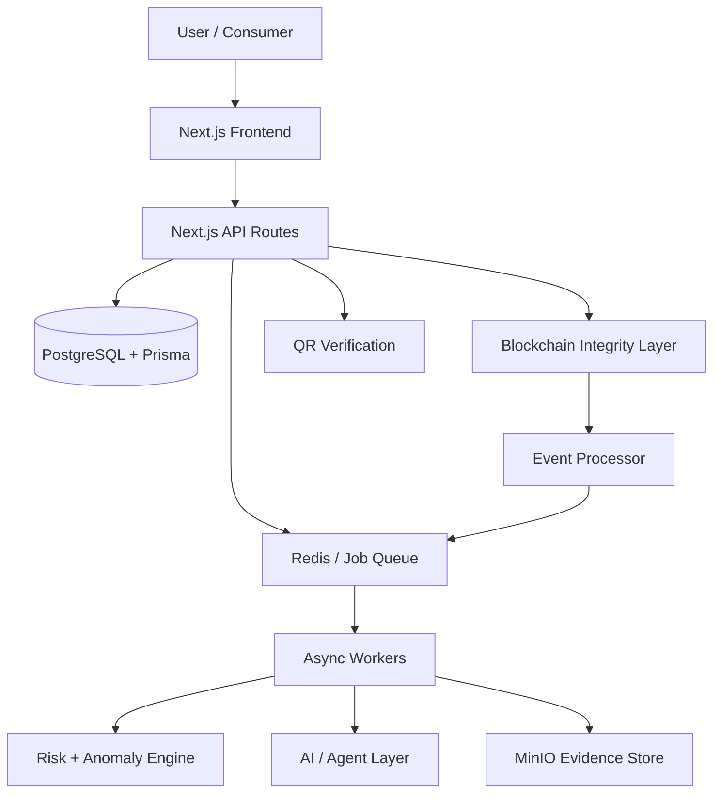
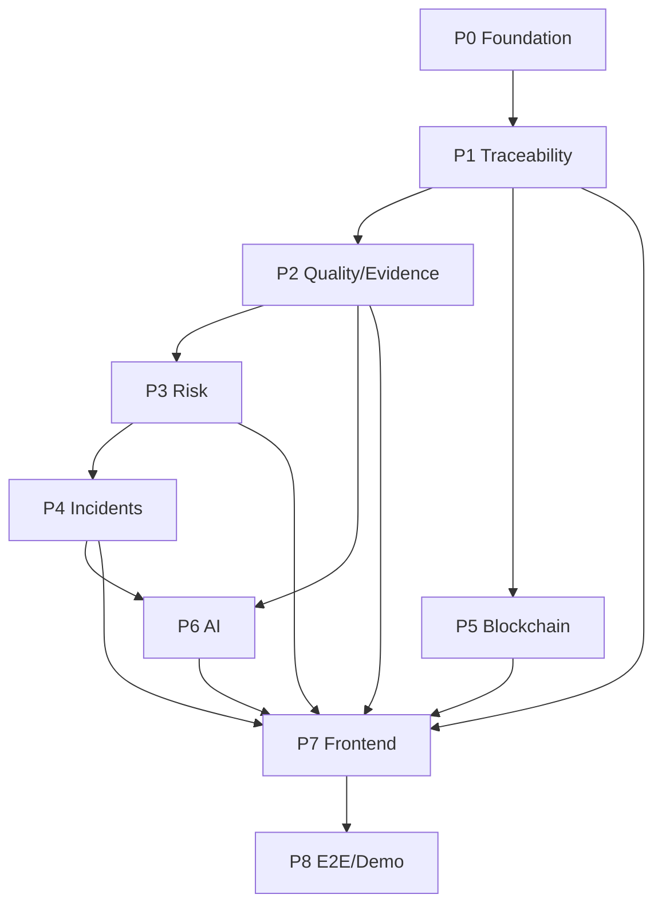

# HIVETRACE / HoneyChain — Implementation Plan

## 1. Project Identity

**Project:** HIVETRACE / HoneyChain  
**SIH:** SIH26021  
**Problem:** Honey Chain — a blockchain-based system for honey traceability and smart beekeeping management.  
**Primary users:** Beekeepers, cooperatives/FPOs, collectors, laboratories, processors, distributors, investigators/regulators, administrators and consumers.

> **Core principle:** Build a practical traceability and risk-operations platform, not a blockchain showcase. PostgreSQL is the operational source of truth; blockchain provides a narrow integrity-proof layer; laboratory evidence establishes physical quality; AI assists prioritisation and investigation.

---

## 2. Product Definition

HIVETRACE connects the honey lifecycle:

```text
Beekeeper → Hive/Farm → Harvest → Collection → Laboratory
         → Processing → Packaging → Distribution → Retail → Consumer
```

### Core capabilities

1. Batch identity and lifecycle tracking.
2. QR-based consumer verification.
3. Laboratory evidence linked to batches.
4. Custody and processing history.
5. Blockchain-backed integrity anchoring for important event bundles.
6. Explainable batch risk scoring.
7. Rule-based anomaly detection for MVP.
8. Alert deduplication and incident clustering.
9. Human investigation workflow.
10. Smart hive and production analytics.
11. AI-assisted evidence summarisation and decision support.
12. Offline-friendly rural data capture and sync.
13. Audit trail and role-based access control.
14. Scalable event processing for large batch volumes.

### Non-negotiable product truth

- Blockchain **does not prove honey purity**.
- AI **does not determine guilt or liability**.
- Risk score **prioritises review**; it does not replace laboratory testing or human decisions.
- Demo data must be clearly marked **synthetic**.
- Real government/lab APIs are future integrations unless formally available.

---

## 3. MVP Definition

The MVP must demonstrate one complete, working workflow:

```text
Beekeeper creates harvest
        ↓
Batch ID generated
        ↓
QR generated
        ↓
Collector custody recorded
        ↓
Lab report linked to batch
        ↓
Rule-based validation + risk score
        ↓
Anomaly detected (seeded demo case)
        ↓
Related alerts clustered into incident
        ↓
Investigator reviews evidence
        ↓
Human resolution recorded
        ↓
Consumer scans QR
        ↓
Verified batch journey displayed
```

### MVP scope

**Must work:**
- Authentication/RBAC.
- Farm/hive registration.
- Harvest/batch creation.
- Batch lifecycle and lineage.
- QR generation and public verification page.
- Lab result upload/entry using synthetic demo data.
- Explainable rule-based risk scoring.
- Alert creation and incident clustering.
- Investigator queue and resolution flow.
- Evidence timeline.
- At least one integrity anchor/proof flow.
- Dashboard with realistic seeded data.

**Not MVP:**
- Nationwide deployment.
- Real government integrations.
- Fully calibrated ML fraud model.
- IoT hardware deployment.
- Full Fabric consortium governance.
- Advanced LLM/RAG everywhere.
- Full ERP/LIMS integration.
- Public-chain storage of sensitive supply data.

---

## 4. Success Criteria

The project is successful when a judge can understand and execute the main story in under two minutes:

1. Register a harvest.
2. Open the new batch.
3. Follow the traceability timeline.
4. See linked lab evidence.
5. See a risk/anomaly event.
6. See related alerts compressed into one incident.
7. Review evidence and resolve the incident.
8. Scan the batch QR as a consumer.
9. See verified provenance without exposing private/internal information.

The system must feel operational rather than mocked. Dynamic lifecycle data, risk rules, clustering and QR verification should actually execute; only clearly identified integrations and external data sources may be simulated.

---

## 5. Target Architecture



### Architecture responsibilities

- **Frontend/API:** Next.js App Router, TypeScript, typed internal APIs.
- **Database:** PostgreSQL + Prisma; operational source of truth.
- **Queue/workers:** Redis + async workers for burst processing and long-running jobs.
- **Risk engine:** deterministic rules first; ML contribution later.
- **AI layer:** evidence-grounded decision support; structured outputs only.
- **Evidence:** MinIO/S3-compatible object storage for reports, photos and documents.
- **Blockchain:** permissioned Fabric is the intended production architecture; public testnet anchoring may be used only for a demo proof.
- **QR:** signed/serialised batch verification URLs.
- **Event processor:** updates downstream risk, incidents, lineage and dashboards asynchronously.

---

## 6. Technology Decisions

| Area | Decision | Purpose |
|---|---|---|
| Frontend | Next.js + TypeScript | Unified full-stack app |
| Styling | Tailwind CSS + reusable component primitives | Consistent design system |
| Charts | Recharts | Operational analytics |
| Maps | MapLibre / Leaflet | Farm/logistics visualisation |
| 3D | React Three Fiber / Three.js | Landing-page parallax only |
| Backend | Next.js API Routes | Simple deployment and shared types |
| ORM | Prisma | Type-safe DB access |
| Database | PostgreSQL | Core operational data |
| Queue | Redis + worker process | Async workloads / bursts |
| Evidence | MinIO / S3-compatible storage | Reports, PDFs, images |
| Blockchain | Hyperledger Fabric (production target) | Shared integrity proof between known parties |
| Demo anchor | Polygon testnet or equivalent, optional | Publicly inspectable demo hash only |
| Smart contract | Go chaincode for Fabric | Ledger event anchoring |
| ML | Python service or isolated worker | Anomaly/risk extensions |
| Baseline ML | scikit-learn | Transparent MVP anomaly detection |
| AI | Provider abstraction; OpenAI/Gemini interchangeable | RAG/decision support |
| Agent orchestration | LangGraph or lightweight workflow | Stateful AI workflows |
| Auth | JWT + RBAC; OIDC-compatible future path | Role access |
| Testing | Vitest + Playwright + contract tests | Unit/API/E2E |
| Deployment | Vercel + Supabase initially | Fast MVP deployment |
| Containers | Docker/Compose for reproducibility | Local integration stack |
| CI | GitHub Actions | Build/lint/test gates |

### Technology discipline

Do not add a technology merely because it sounds advanced. Prefer the smallest stack that solves the requirement cleanly.

---

## 7. Domain Model

Core entities:

```text
Organisation
User
Role
Farm
Hive
Harvest
Batch
BatchLineage
BatchEvent
CustodyTransfer
QualityTest
LabReport
Document
QRToken
RiskScore
Alert
Incident
InvestigationCase
BlockchainAnchor
AIAnalysis
ModelVersion
ConsentRecord
AuditLog
Notification
Shipment
```

### Minimum batch fields

- id
- public batch code
- farm/hive reference
- parent batch(s), if transformed
- honey type/floral source
- origin region
- harvest date/time
- quantity
- current stage
- current custodian
- quality status
- risk score/state
- verification state
- created/updated timestamps

### Event types

```text
BATCH_CREATED
HARVEST_RECORDED
CUSTODY_TRANSFERRED
LAB_SAMPLE_CREATED
LAB_RESULT_ADDED
PROCESSING_COMPLETED
PACKAGING_COMPLETED
SHIPMENT_DISPATCHED
SHIPMENT_RECEIVED
QR_ISSUED
RISK_RECALCULATED
ANOMALY_DETECTED
INCIDENT_CREATED
INVESTIGATION_OPENED
INVESTIGATION_RESOLVED
BLOCKCHAIN_ANCHORED
```

---

## 8. Risk Engine

### MVP scoring

Use transparent, configurable components:

```text
Risk = min(100,
  0.40 * LabRisk +
  0.20 * TraceabilityRisk +
  0.15 * SupplierHistory +
  0.15 * GeoTemporalAnomaly +
  0.10 * ProcessSensorRisk
)
```

Each component is 0–100.

Default levels:

- **LOW:** 0–29
- **MEDIUM:** 30–59
- **HIGH:** 60–100

These are demo defaults only and must be configurable/calibrated during field validation.

### MVP rule signals

- duplicate QR/batch ID
- custody gap
- impossible or inconsistent timeline
- geolocation mismatch
- failed/out-of-range lab result
- abnormal yield
- unexpected split/merge/processing relationship
- previously confirmed supplier/actor issue

### Decision policy

```text
LOW → auto-clear / normal workflow
MEDIUM → automated revalidation / monitor
HIGH → human investigation queue
```

The UI must always expose the reasons behind the score.

---

## 9. Large-Scale Alert Handling

The system must be designed around **incident reduction**, not human review of every alert.

Example:

```text
1,000,000 batches
        ↓
Validation
        ↓
100,000 alerts
        ↓
Deduplication
        ↓
Clustering
        ↓
~hundreds of incidents/patterns
        ↓
Priority scoring
        ↓
Human investigation
```

### Clustering inputs

- time window
- location grid
- actor/custodian links
- lab pattern
- anomaly type
- batch lineage
- shipment/route relationship

### MVP technique

Use deterministic grouping plus DBSCAN/graph connected components where practical.

The investigator should see:

> “18,420 affected batches — common GPS anomaly — 12 collectors — 14:10–15:35”

rather than 18,420 individual alerts.

---

## 10. Blockchain Strategy

### On-chain / anchored

- pseudonymous batch reference
- event type
- timestamp
- signer/reference identity
- event bundle hash or Merkle root
- ledger status
- anchor transaction/reference

### Off-chain

- PII
- exact sensitive GPS
- photos
- PDFs
- lab CSVs
- sensor streams
- prices
- complete operational records

### Integrity flow

```text
Canonical event JSON
      ↓
SHA-256 / Merkle root
      ↓
Persist PENDING
      ↓
Anchor
      ↓
Save transaction/reference
      ↓
Mark ANCHORED
```

If the ledger is unavailable, the operational system continues with signed pending records. A reconciliation worker retries anchoring later.

---

## 11. AI / Agent Plan

AI must be useful, bounded and evidence-grounded.

### Agent roles

**Orchestrator** — routes workflow requests.  
**Evidence Agent** — gathers relevant batch/lab/history evidence.  
**Risk Agent** — explains risk contributors; deterministic rules remain authoritative for MVP.  
**Incident Agent** — summarises clustered patterns.  
**Hive Intelligence Agent** — answers beekeeper questions from approved data.  
**Report Agent** — creates investigator summaries.

### AI rules

- Never expose hidden chain-of-thought.
- Return structured JSON when consumed by code.
- Ground answers in retrieved evidence.
- Cite source documents/events in UI.
- Limit tool calls.
- Keep a provider abstraction.
- Permit AI to be disabled without breaking the MVP.
- Do not let AI directly approve or reject legal/fraud liability.

### MVP AI

Use AI primarily for:

- evidence summarisation
- natural-language explanation of risk reasons
- hive/production insights
- incident summaries

Do not make an unvalidated LLM responsible for the core risk calculation.

---

## 12. Offline-First Field Workflow

Initial rural workflow should support intermittent connectivity.

### MVP approach

- responsive PWA
- local draft storage
- queued writes
- sync state
- retry on reconnect
- compressed image upload where appropriate
- short forms and large touch targets
- camera/QR capture

UI states:

```text
OFFLINE — changes queued
SYNCING...
SYNCED ✓
SYNC ERROR — retry
```

Target low-end Android usability before adding a native application.

---

## 13. Security & Governance

### Authentication / access

RBAC roles:

```text
BEEKEEPER
COLLECTOR
LAB
PROCESSOR
DISTRIBUTOR
INVESTIGATOR
ADMIN
CONSUMER
```

Critical actions require stronger controls, especially laboratory publication, investigation resolution and ledger/governance actions.

### Data security

- TLS in transit
- encryption at rest
- least privilege
- organisation/tenant isolation
- signed object URLs
- audit logs
- key rotation
- backups
- restore drills
- no secrets in AI context

### Privacy

Minimise personal data. Keep sensitive information off-chain. Consumer QR pages expose only consented provenance information.

### QR security

Use serialised/signed verification tokens, duplicate-scan detection and tamper-evident label options. QR alone does not prove physical authenticity.

---

## 14. API Plan

Initial internal APIs:

| Method | Path | Purpose |
|---|---|---|
| GET/POST | `/api/farms` | Farm management |
| GET/POST | `/api/hives` | Hive management |
| GET/POST | `/api/batches` | Batch lifecycle |
| GET | `/api/batches/[id]` | Batch detail |
| POST | `/api/batches/[id]/events` | Add lifecycle event |
| GET/POST | `/api/quality` | Lab evidence |
| GET | `/api/risk` | Risk summaries |
| GET | `/api/alerts` | Alerts |
| GET | `/api/incidents` | Incident clusters |
| POST | `/api/incidents/[id]/resolve` | Human resolution |
| GET | `/api/traceability/[batch]` | Public/internal traceability |
| GET | `/api/verify/[batch]` | Consumer verification |
| GET | `/api/anchors` | Integrity proof state |
| POST | `/api/ai/query` | AI decision support |
| GET | `/api/reports` | Reports |
| GET | `/api/health` | Healthcheck |

All write endpoints must validate input at the boundary and return consistent error structures.

---

## 15. Frontend Plan

### Routes

```text
/
/login
/dashboard
/hives
/hives/[id]
/harvests/new
/batches
/batches/[id]
/traceability/[id]
/quality
/quality/[id]
/risk
/incidents
/incidents/[id]
/intelligence
/supply-chain
/blockchain
/reports
/settings
/verify/[batch]
```

### Core components

- KPI cards
- Batch table
- Batch timeline
- Batch lineage graph
- Risk meter
- Alert card
- Incident cluster card
- Investigation panel
- Evidence drawer
- Hive card
- Quality table
- AI insight panel
- QR card
- Verification screen
- Blockchain proof card
- Map panel
- Notification center
- Mobile bottom navigation

### UX state requirements

Every major view supports:

- loading/skeleton
- empty
- error
- retry
- offline
- success
- partial data

Use deterministic synthetic demo data until APIs are integrated.

---

## 16. Design Direction

The frontend should follow the product design specification:

**Premium minimalism + restrained glassmorphism + AgriTech trust + investigation-grade data UI.**

### Signature visual elements

- subtle honey-amber accents
- neutral enterprise surfaces
- selective glass panels
- soft depth/shadows
- clean typography
- elegant charts
- traceability node/line language
- restrained honeycomb geometry
- interactive 3D/parallax landing hero

Avoid generic AI SaaS visuals, crypto UI, cartoon bees and excessive gradients.

The 3D/parallax hero should be lightweight and isolated from operational screens.

---

## 17. Testing Strategy

### Unit

Vitest for:

- risk calculations
- anomaly rules
- clustering utilities
- API validation
- domain transforms
- QR signing/verification helpers

### Integration

- API ↔ Postgres
- API ↔ object storage
- event processing ↔ risk engine
- anchor/reconciliation flow

### E2E

Playwright:

```text
login
→ create farm
→ create hive
→ create batch
→ add lab result
→ risk recalculation
→ incident creation
→ investigation resolution
→ public QR verification
```

### Performance

- Lighthouse baseline
- batch-table pagination/virtualisation where needed
- load-test event ingestion target

### Security

- no secrets in source/tests
- auth boundary tests
- role access tests
- signed URL tests
- malformed input tests

---

## 18. Observability

Log and trace:

- API requests
- event-processing jobs
- risk calculations
- cluster creation
- AI invocation metadata
- tool calls
- blockchain anchoring/reconciliation
- sync failures

Store operational metrics such as:

- processing latency
- queue depth
- anchor failure rate
- AI token usage/cost
- incident creation rate
- investigation resolution time

Do not store hidden model chain-of-thought.

---

## 19. Implementation Phases

### PHASE 0 — FOUNDATION

- project setup
- environment validation
- PostgreSQL/Prisma
- auth/RBAC skeleton
- Vitest/Playwright
- base design system
- logging/healthcheck

### PHASE 1 — CORE TRACEABILITY

- farms/hives
- batch creation
- lifecycle events
- batch lineage
- custody transfer
- QR generation/verification

### PHASE 2 — QUALITY + EVIDENCE

- lab result workflow
- PDF/CSV evidence storage
- sample/batch linking
- quality states
- evidence timeline

### PHASE 3 — RISK ENGINE

- deterministic validation rules
- risk score
- risk states
- alerts
- explanation metadata

### PHASE 4 — INCIDENT INTELLIGENCE

- deduplication
- clustering
- incident model
- investigator queue
- evidence graph
- human resolution/audit

### PHASE 5 — BLOCKCHAIN INTEGRITY

- canonical event serialization
- hash/Merkle root
- anchor service
- anchor reconciliation
- proof view
- public-demo testnet anchor if useful

### PHASE 6 — AI / AGENT LAYER

- provider abstraction
- evidence retrieval
- Hive Intelligence
- incident summaries
- risk explanation
- report generation

### PHASE 7 — FRONTEND POLISH

- dashboard refinement
- 3D/parallax landing
- responsive/mobile UX
- motion system
- accessibility
- empty/error/offline states

### PHASE 8 — E2E + HACKATHON DEMO

- complete demo dataset
- end-to-end scenario
- performance smoke test
- security review
- pitch flow
- final build verification

---

## 20. Task Registry

Use the following task protocol. A task is complete only when implementation, tests, verification and documentation are complete.

### Phase 0

- `[ ] P0.01` Initialise Next.js/TypeScript project.
- `[ ] P0.02` Configure Prisma + PostgreSQL.
- `[ ] P0.03` Configure auth/RBAC skeleton.
- `[ ] P0.04` Configure Vitest + Playwright.
- `[ ] P0.05` Create design tokens/component primitives.
- `[ ] P0.06` Add healthcheck, structured logging and env validation.

### Phase 1

- `[ ] P1.01` Create Farm/Hive schema + APIs.
- `[ ] P1.02` Create Batch + BatchEvent schema.
- `[ ] P1.03` Implement harvest registration.
- `[ ] P1.04` Implement custody transfers.
- `[ ] P1.05` Implement batch lineage.
- `[ ] P1.06` Generate/sign QR verification tokens.
- `[ ] P1.07` Build public verification page.

### Phase 2

- `[ ] P2.01` Create QualityTest/LabReport models.
- `[ ] P2.02` Implement evidence upload/storage.
- `[ ] P2.03` Build quality workflow.
- `[ ] P2.04` Link evidence into batch timeline.

### Phase 3

- `[ ] P3.01` Implement deterministic anomaly rules.
- `[ ] P3.02` Implement risk scoring.
- `[ ] P3.03` Persist risk versions/reasons.
- `[ ] P3.04` Create alerts.
- `[ ] P3.05` Add low/medium/high triage state machine.

### Phase 4

- `[ ] P4.01` Deduplicate alerts.
- `[ ] P4.02` Implement clustering.
- `[ ] P4.03` Create Incident model.
- `[ ] P4.04` Build investigation workspace.
- `[ ] P4.05` Add evidence graph.
- `[ ] P4.06` Add resolution + audit history.

### Phase 5

- `[ ] P5.01` Canonical event hashing.
- `[ ] P5.02` Implement anchor service.
- `[ ] P5.03` Implement reconciliation worker.
- `[ ] P5.04` Build proof viewer.
- `[ ] P5.05` Add optional demo public-chain anchor.

### Phase 6

- `[ ] P6.01` Add LLM provider abstraction.
- `[ ] P6.02` Add evidence retrieval.
- `[ ] P6.03` Build Hive Intelligence.
- `[ ] P6.04` Build Incident Summary agent.
- `[ ] P6.05` Add report generation.
- `[ ] P6.06` Add AI evaluation against seeded cases.

### Phase 7

- `[ ] P7.01` Build dashboard.
- `[ ] P7.02` Build batch/traceability UX.
- `[ ] P7.03` Build incident/risk UX.
- `[ ] P7.04` Build mobile field workflow.
- `[ ] P7.05` Add 3D/parallax landing.
- `[ ] P7.06` Add motion/accessibility polish.

### Phase 8

- `[ ] P8.01` E2E demo scenario.
- `[ ] P8.02` Seed realistic synthetic dataset.
- `[ ] P8.03` Load/performance smoke test.
- `[ ] P8.04` Security checklist.
- `[ ] P8.05` Final pitch/demo rehearsal.

---

## 21. Dependency Graph



### Critical path

```text
Foundation
→ Traceability
→ Quality/Evidence
→ Risk
→ Incidents
→ E2E Demo
```

AI and blockchain should not block the core traceability MVP.

---

## 22. Data Integrity Rules

1. Every batch has a stable internal ID and public code.
2. Every lifecycle change becomes an immutable-style event record; corrections create new events instead of deleting history.
3. Batch splits/merges create explicit lineage records.
4. Lab results are versioned.
5. Risk scores are versioned with rule/model version.
6. Investigations record decision, actor, time and reason.
7. Blockchain anchors refer to canonical event bundles, not arbitrary UI state.
8. Consumer QR data is a projection of approved/consented provenance fields.

---

## 23. External Integration Policy

Do not assume external APIs exist.

### Future integration targets

- FSSAI-related workflows
- APEDA/TraceNet ecosystem
- National Bee Board/NBHM ecosystem
- accredited laboratories/LIMS
- ERP/logistics systems
- GS1/EPCIS-compatible systems

Until formally verified, implement:

- adapters/interfaces
- CSV import/export
- REST/webhook placeholders
- signed document upload

Never fabricate an API response and present it as a real government integration.

---

## 24. Demo Data Strategy

All demo data is synthetic and clearly labelled.

Create:

- 50+ hives
- multiple farms
- 500+ batches
- realistic batch lineage
- quality results
- shipments
- 100+ alerts
- multiple clustered incidents
- several investigation outcomes

For scale demonstration, generate a separate synthetic load dataset up to 1,000,000 batch/event records. Do not render all records in the UI.

---

## 25. Key Risks & Mitigation

| Risk | Impact | Mitigation |
|---|---|---|
| Fake source data | High | Role verification, signed lab evidence, audits, cross-checks |
| Low rural adoption | High | Offline-first, cooperative-assisted onboarding, simple forms |
| False positives | High | Transparent rules, clustering, human confirmation, pilot calibration |
| AI hallucination | Medium | Evidence grounding, structured outputs, model evaluation |
| Blockchain complexity | Medium | Keep ledger narrow; operational DB remains primary |
| Ledger outage | Medium | Pending anchor state + async reconciliation |
| QR cloning | Medium | Signed tokens, duplicate-scan detection, tamper-evident labels |
| Privacy leakage | High | Data minimisation, RBAC, off-chain sensitive data |
| Scope creep | High | MVP gate; defer integrations/IoT/advanced ML |

---

## 26. Definition of Done

### Per task

- Implementation matches acceptance criteria.
- Tests pass.
- Typecheck/build/lint pass.
- Security boundaries preserved.
- Documentation updated.
- No unrelated refactors.

### Project MVP

- Batch can be created through UI/API.
- Batch lifecycle is persisted.
- QR verification works.
- Lab evidence is linked.
- Risk score is generated with explanations.
- Alerts are created and clustered.
- Investigator can resolve an incident.
- At least one event bundle gets an integrity anchor.
- Consumer sees a verified provenance journey.
- Demo can run from a clean environment.

---

## 27. Execution Protocol for Coding Agents

1. Read `AGENTS.md` and project docs if present.
2. Read this `IMPLEMENTATION_PLAN.md`.
3. Inspect the current repository before editing.
4. Identify the next incomplete task whose dependencies are satisfied.
5. Implement **only that task** unless a dependency requires a tightly scoped supporting change.
6. Run that task's verification commands.
7. Self-review for security, correctness and scope.
8. Update affected docs.
9. Mark the task `[x]` only after verification.
10. Record blockers as `[!]` with a short reason.
11. Move to the next unblocked task.

### Status system

- `[ ]` TODO
- `[~]` IN PROGRESS
- `[x]` COMPLETE
- `[!]` BLOCKED

### Agent behaviour rules

- Do not invent requirements.
- Do not replace the chosen architecture without an explicit decision.
- Do not add production claims to demo data.
- Do not expose secrets to AI agents.
- Do not let an LLM directly perform high-impact enforcement decisions.
- Do not implement future features before the MVP critical path is stable.
- Prefer small, testable commits.

---

## 28. Documentation Set

Maintain these documents as the implementation evolves:

```text
docs/
  01-product-overview.md
  02-user-flows.md
  03-tech-stack.md
  04-system-architecture.md
  05-database-design.md
  06-api-design.md
  07-risk-engine.md
  08-ai-agent-architecture.md
  09-ui-ux-design-system.md
  10-security-privacy.md
  11-blockchain-integrity.md
  12-offline-sync.md
  13-testing-strategy.md
  14-demo-script.md
  15-deployment.md
```

Documentation must describe the current implementation, not the desired future state.

---

## 29. Immediate Next Actions

1. Create/confirm the HoneyChain repository and branch.
2. Initialise Phase 0.
3. Implement the core data model and batch lifecycle before advanced AI/blockchain work.
4. Build the complete MVP demo path with synthetic data.
5. Add risk/incident clustering.
6. Add blockchain integrity proof.
7. Add AI decision-support layer.
8. Polish frontend and mobile workflows.
9. Run E2E demo and load smoke tests.
10. Freeze MVP scope before internal SIH presentation.

---

## 30. Team Handoff

At every handoff, report:

### Completed
- tasks completed
- files changed
- verification results

### Current
- task in progress

### Blocked
- exact blocker and required dependency

### Tests
- unit
- integration
- E2E
- build/lint

### Documentation updated
- changed docs

### Next recommended task
- one concrete next task

### Current MVP focus

```text
CORE TRACEABILITY
→ QUALITY EVIDENCE
→ RISK
→ INCIDENTS
→ HUMAN REVIEW
→ QR VERIFICATION
```

Everything else is secondary until this path works end-to-end.
