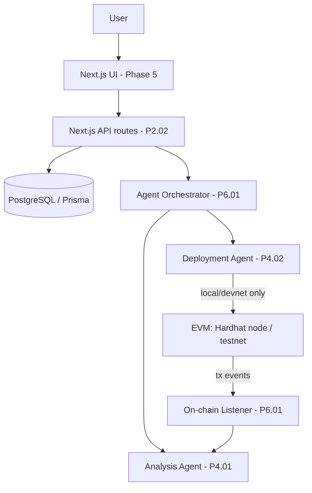

# System Architecture

## Architecture Status
- **Status:** All implementation phases (P0–P6) complete; MVP definition of done reachable.
- Frontend/API shell: Next.js 16 App Router (`src/app/**`), src-dir layout (DEC-001).
- Database: PostgreSQL 17 + Prisma 7 via driver adapter (DEC-003), local dev DB in rootless podman (DEC-004).
- EVM tooling: Hardhat 3.14 + `@nomicfoundation/hardhat-toolbox-mocha-ethers` (ethers v6, mocha/chai). Project is ESM (`"type": "module"`, forced by Hardhat 3 — DEC-006).

## Components
| Component | Responsibility | Interfaces | Failure modes |
|---|---|---|---|
| Next.js app (`src/app/**`) | Dashboard + API route handlers | HTTP :3000 | Build/type errors surface at CI/build |
| Prisma client (`src/lib/db.ts`) | Singleton DB access, adapter-wired | `import { db } from "@/lib/db"` | Throws at init if `DATABASE_URL` missing; connection errors on query |
| SimpleHoneypot (`contracts/`) | Deceptive-but-safe vault template with attack telemetry | Solidity ABI: deposit/withdraw/receive/sweep + events | Reverts on overdraw/unauthorized sweep; failed external calls restore state and emit `AttackDetected` |
| ReentrancyAttacker (`contracts/`) | Test/E2E fixture simulating a naive reentrancy exploiter | Solidity ABI: attack() | Used only against local EVM |
| Hardhat config (`hardhat.config.ts`) | Compile/test toolchain, solc 0.8.28 profiles | `npx hardhat compile|test` | Compiler download requires network |
| AI provider (`src/lib/ai/provider.ts`) | LLM abstraction (OpenAI/Gemini) over LangChain | `generateText` / `createChatModel` | Clear error if provider key missing |
| Analysis Agent (`src/agents/analysisAgent.ts`) | Tx → structured `ThreatReport` | `analyzeTransaction` (mockable tool+model) | Throws on tool error / schema-invalid output |
| Deployment Agent (`src/agents/deployAgent.ts`) | Template selection + deploy with approval gate | `deployAgent` | Rejects unapproved non-local targets |
| On-chain Listener (`src/services/listener.ts`) | Polls blocks for txs to monitored honeypots | `startListener` (provider-injectable) | Errors surfaced via `onError`; self-rescheduling |
| Orchestrator (`src/services/orchestrator.ts`) | Links detected tx → analysis → DB persistence | `processTransaction` | Throws if tx targets unknown honeypot |

## High-Level Flow

## EVM Layer (P1.01)
- **Template policy:** honeypot contracts are *deceptive but safe* — they present a classic reentrancy bait but keep funds safe via checks-effects-interactions and emit durable telemetry (`AttackDetected`, `ReentryAttempted`, counters). Rationale and trade-offs in DEC-005. Genuinely draining exploits would revert attacker frames and destroy the observability the Analysis Agent depends on.
- **Events are the product data plane:** listener (P6.01) consumes `Deposited`/`Withdrawn`/`AttackDetected`/`ReentryAttempted`; agent narratives must be grounded in these.
- **Network policy:** local simulated EVM by default. Sepolia is intentionally NOT configured yet; when added it must use Hardhat `configVariable()` + keystore (never plaintext keys in config/env) per plan §7.

## Data Flow
1. Deploy (P1.02 service → P4.02 agent): template selection → deploy to local EVM → persist address/network/status in DB (P2.01 schema).
2. Interact: attacker tx hits honeypot; contract emits telemetry events.
3. Observe: listener polls/watches honeypot addresses (P6.01), stores raw event rows.
4. Analyze: orchestrator triggers Analysis Agent (P4.01) with calldata/logs context; structured ThreatReport persisted.
5. Serve: API routes expose honeypots/reports (P2.02); dashboard renders (Phase 5).

## Authentication Flow
TBD — no auth layer yet. Plan §12 marks POST `/api/honeypots` as Admin-protected when built.

## AI / Agent Flow
Implemented (P3.01/P4.x). Constraints from plan §13 apply: provider abstraction (`src/lib/ai/provider.ts`), structured JSON output (Zod-validated `ThreatReport`), no secrets in LLM context (keys stay in env, never embedded in prompts). The Orchestrator wires the Listener's detected tx → `analyzeTransaction` → `Event`+`ThreatReport` rows; HIGH/CRITICAL severities flip the honeypot to `COMPROMISED`.

## External Integrations
| Integration | Purpose | Status |
|---|---|---|
| Local EVM (Hardhat/EDR) | Compile, simulate attacks, deploy honeypots | Active (P1.01) |
| Sepolia RPC | Public testnet deployment | Not configured (needs approval gate + keystore) |
| LLM providers | Threat narrative generation | Active (P3.01); OpenAI default, Gemini alt |

## Failure Paths
- DB unreachable: integration tests skip (not fail); runtime requests surface 5xx once API exists.
- Contract call failure: `withdraw` restores user balance and emits `WithdrawalFailed`/`AttackDetected` instead of reverting user frames.
- Solc/EDR binaries: fetched at install/compile; offline builds require prior cache.
